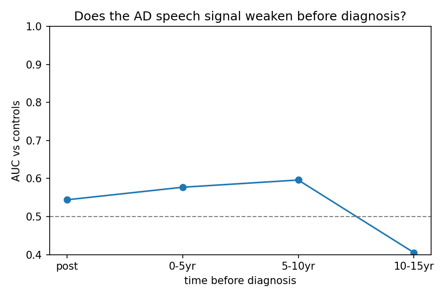

<div align="center">

# DementiaNet VoiceScreen

### Can a 60 second voice clip flag Alzheimer's risk?

**A weekend proof of concept that turns ordinary speech into an early warning signal for cognitive decline. Built end to end, evaluated honestly, and stress tested until it told the truth.**

[](https://www.python.org/)
[](https://scikit-learn.org/)
[](LICENSE)
[](#honest-limitations)

</div>

---

## The problem

Alzheimer's quietly rewires the brain for 10 to 20 years before diagnosis. The new disease modifying drugs (lecanemab, donanemab) work best the earlier you catch it. But today's tools for catching it early are the opposite of scalable: PET scans (roughly 1,500 to 4,000 euro, radiation, specialist centres), lumbar punctures, or blood draws that still need a clinic.

There is a missing first step: a cheap, noninvasive filter that decides who even needs the expensive test.

## The bet

Speech is one of the most cognitively demanding things humans do. Memory, word finding, planning, and motor control all fire at once. Alzheimer's degrades exactly those systems. So the hypothesis:

> A 60 second voice recording, captured on any phone, could pre screen for cognitive decline at near zero cost.

We set out to test that bet properly before anyone spends real money chasing it.

## What we built (in a weekend)

An end to end, fully reproducible pipeline, from raw audio to an honest performance number:

```
 Open speech data   →   Voice features    →    Model     →   Honest evaluation
 344 clips,              voice quality +        linear         split by person
 171 speakers           pause timing           classifier     + a locked test set
```

* **Zero data cost.** Built on DementiaNet, a free corpus of real spontaneous speech from public figures later diagnosed with dementia, plus healthy controls of similar age.
* **Off the shelf features.** Voice quality and prosody (openSMILE eGeMAPS) plus speech timing measures. No exotic hardware, no proprietary tech.
* **Evaluation you can trust.** We split by person (so no speaker leaks across training and testing), locked away a test set we opened exactly once, and audited for confounds.

## What we found

**A real, if modest, signal: AUC about 0.62 on a locked test set the model had never seen.** Speech does carry Alzheimer's related information, from casual audio, with commodity features.

| Model | Cross validation | Locked test set |
|---|:---:|:---:|
| Logistic Regression | 0.57 | 0.61 |
| **SVM (our pick)** | 0.60 | **0.62** |
| Gradient Boosting | 0.61 | 0.42 (overfit) |

## The part we are most proud of: we tried to fool ourselves, and caught it

Anyone can report a good cross validation number. We built the process that stops us believing our own hype, and it killed two tempting results before they could become a bad pitch:

1. **A flashier model that was secretly cheating.** Gradient boosting looked best in cross validation (0.61), then dropped to 0.42, worse than a coin flip, on the locked test set. It had memorised quirks of individual speakers. Our test set caught it, so we dropped it.
2. **A beautiful early detection curve that was not real.** An early model showed the signal fading cleanly from diagnosis back a decade, exactly the story we wanted. Under the model that actually generalizes, it flattened out. So we do not claim it.

<div align="center">
<br>
<sub><b>Honesty in a chart.</b> Once we used the model that generalizes, the "signal appears years early" story did not hold. We report it anyway.</sub>
</div>

> Why a jury should care: in health, the teams that win are the ones clinicians and regulators can trust. We move fast and we refuse to overclaim, and we have shown we can tell the difference.

## The vision

Speech is not the diagnosis. It is the funnel that makes early diagnosis affordable at population scale:

```
 Everyone 55+           Flagged by voice          Confirmed
 60 sec voice check  →  blood test (p-Tau217)  →  PET or specialist  →  Treatment
 near zero cost,        cheaper, targeted         reserved for few       in the window
 any phone
```

**Interactive product prototype:** shipping with this submission at `https://ct-s.github.io/dementianet-voicescreen/`

## How it works

<details>
<summary><b>Click for the technical pipeline</b></summary>

<br>

1. `data/download` fetches and standardizes clips to 16 kHz mono.
2. `data/enrich_manifest` labels each clip (diagnosis, speaker, years before diagnosis) from filename and metadata.
3. `data/make_split` builds a fixed, stratified split at the speaker level (no leakage).
4. `features/pauses` computes silence and pause timing features (percentage silence, pause rates, articulation rate).
5. `features/acoustic` runs openSMILE eGeMAPS voice quality and prosody (jitter, shimmer, F0, HNR, and more).
6. `features/filled_pauses` detects "uh" and "um" via Praat (tested, added no signal here, a clean negative result).
7. `models/train` runs speaker grouped cross validation on the development set. The locked test set is evaluated only with `--test`.
8. `models/ablation`, `interpret`, and `longitudinal` cover which features matter, confound checks, and the time before diagnosis analysis.

**Feature verdict:** voice quality carries the signal, pause timing is weak on its own, and filled pauses add nothing on this corpus.

**Confound we caught and removed:** the model was exploiting clip length (an artifact of how videos were trimmed, not cognition), so we excluded it and re measured.

</details>

## Reproduce it

<details>
<summary><b>Click for setup and run commands</b></summary>

<br>

```bash
conda env create -f environment.yml
conda activate dementianet
pip install -e .

# Get DementiaNet audio (see praat/README.md and config paths), then:
python -m dementianet.data.enrich_manifest
python -m dementianet.data.make_split
python -m dementianet.features.pauses
python -m dementianet.features.acoustic
python -m dementianet.models.train            # cross validation on the dev set
python -m dementianet.models.train --test     # final locked test number (run once)
python -m dementianet.models.longitudinal     # time before diagnosis analysis
```

Raw audio is not included (it stays gitignored). The repo ships the code, the derived metrics, the figures, and the report.

</details>

## Honest limitations

We would rather tell you what is not proven than have you find out later:

* 0.62 AUC is a proof of concept, not a product. Published clinical systems using controlled speech tasks reach 0.77 to 0.93. That is the target, and the gap is the roadmap.
* Celebrity interview audio is noisy and edited. Diagnoses are public record, not confirmed by biomarkers.
* English dominant, with no fairness testing across demographics yet.
* Not a medical device. Research proof of concept only.

## What is next

* Controlled elicitation (picture description, story recall), the tasks behind the field's best results.
* Proprietary, biomarker confirmed clinical audio, the real moat.
* Deep acoustic embeddings (wav2vec2, HuBERT) against the eGeMAPS baseline.
* A regulatory path for a speech based screening tool (Software as a Medical Device).

---

<div align="center">
<sub>Built with Python, scikit-learn, openSMILE, and Praat. Data: <a href="https://github.com/shreyasgite/dementianet">DementiaNet</a> (de Jong et al. for the Praat fluency scripts). MIT licensed.<br>A research proof of concept. Not a medical device.</sub>
</div>
